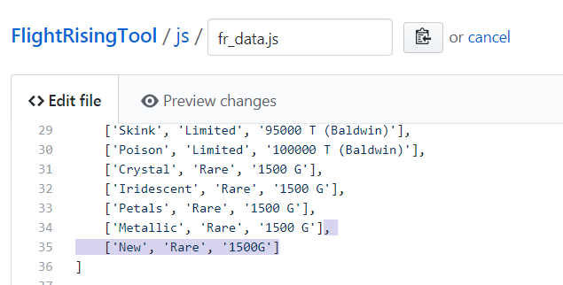
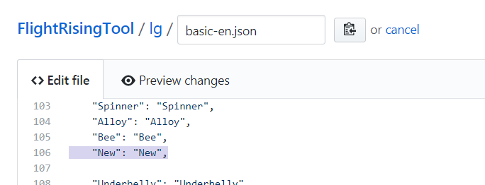
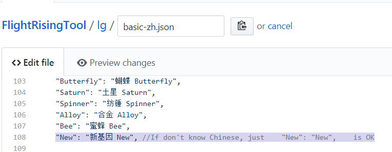
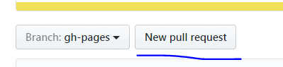
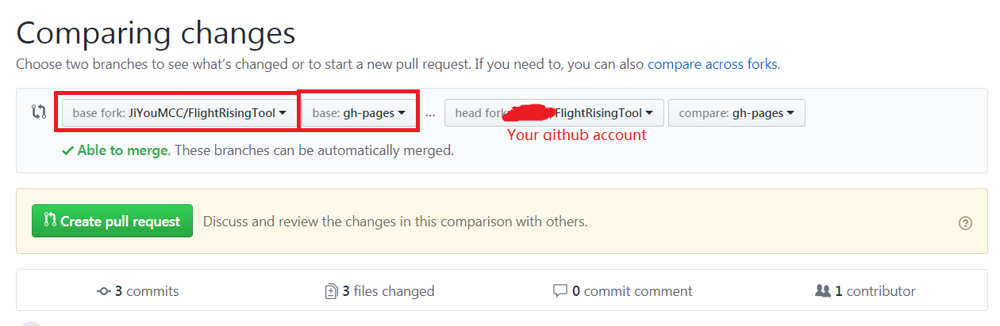
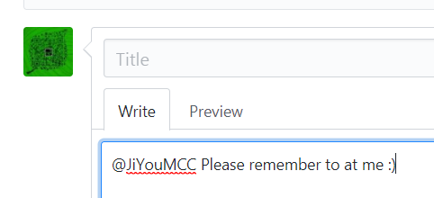

# How to Add New Gene #
如何加新基因

## Step 1 Fork the repo 
第一步： 复刻一下这个项目

## Step 2 Modify js/fr_data.js
第二步：修改js/fr_data.js

Add the gene, please remember the ','

在里面加基因信息，别忘了逗号

## Step 3 Modify lg/basic_en.js
第三步：修改lg/basic_en.js

Please remember the ','

别忘了逗号

## Step 4 Modify lg/basic_zh.js
第四步：修改lg/basic_zh.js

Please remember the ','. If you don't know Chinese, just add as the same as English file.

别忘了逗号。如果看到这句话你肯定懂中文吧，就算不知道怎么翻译随便写个啥也行……

## Step 5 Create new pull request
第五步：点New pull request

## Step 6 Pay attention to the red boxes
第六步：注意我标红的地方

## Step 7 Remember to at me
第七步：注意最好艾特我下，这样我反应可以快一些

